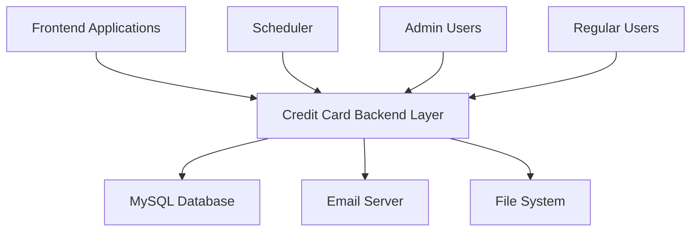
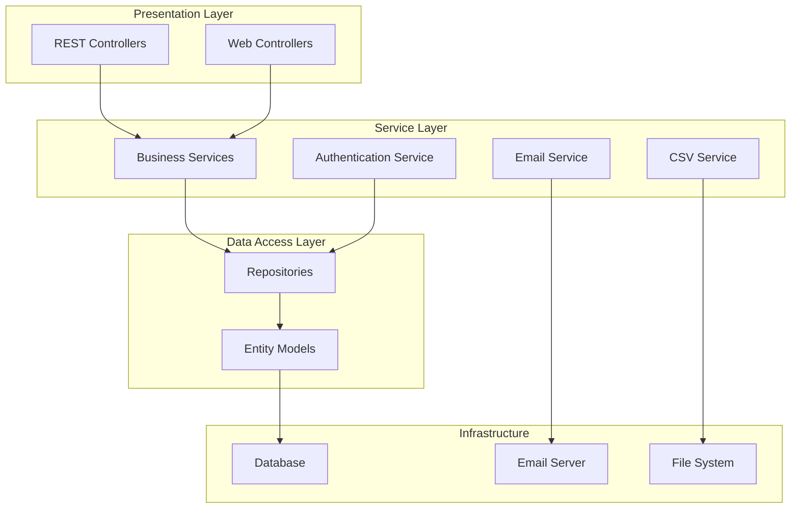
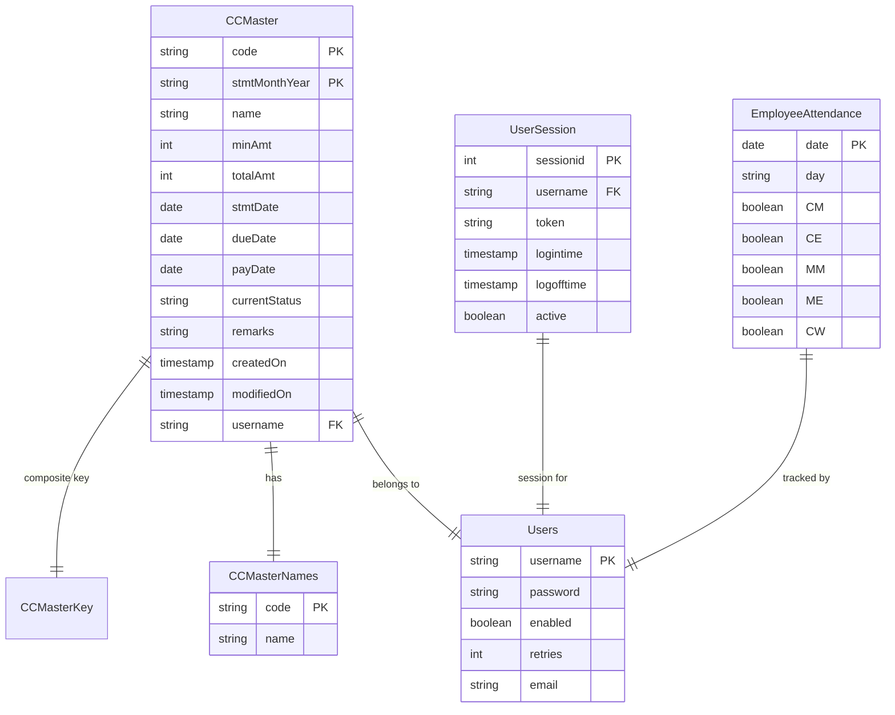
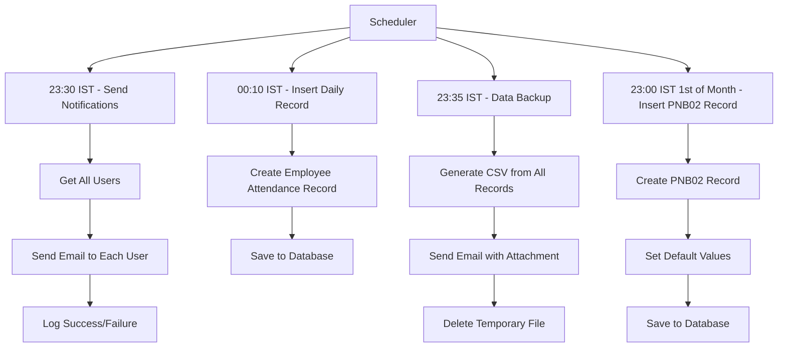
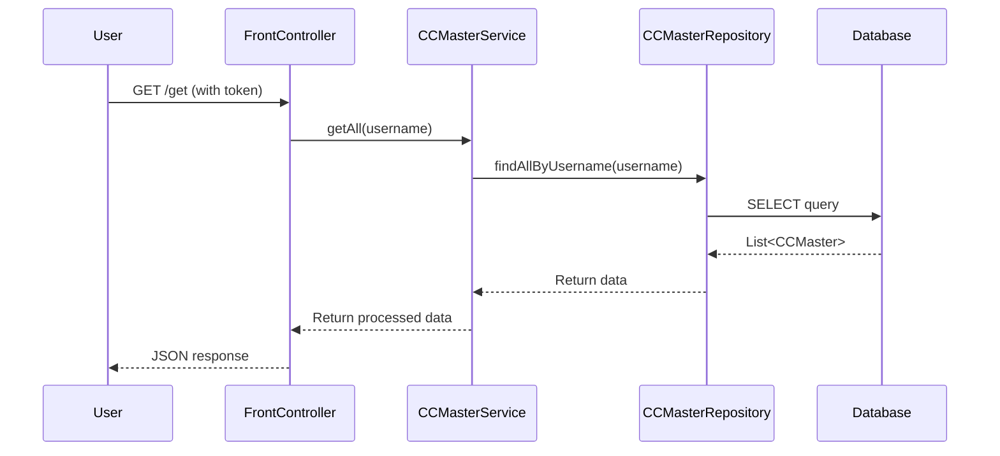
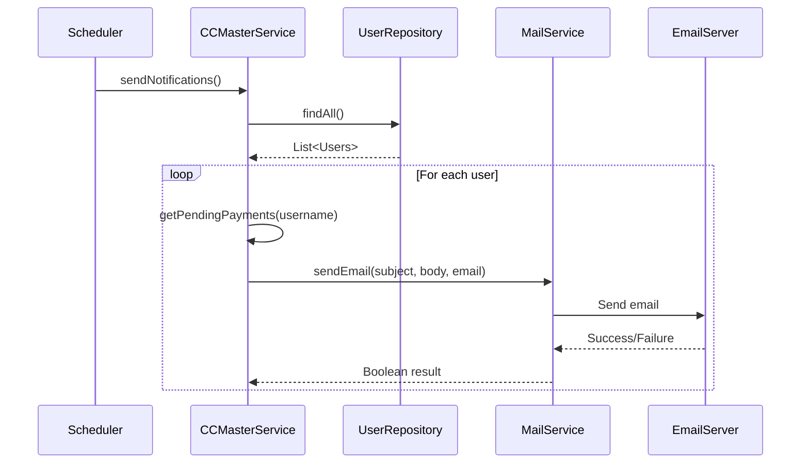
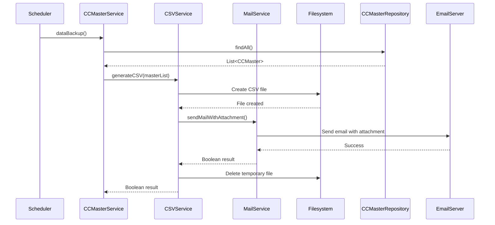
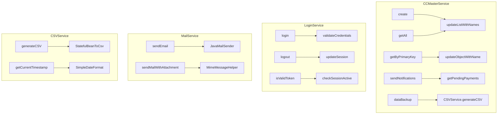
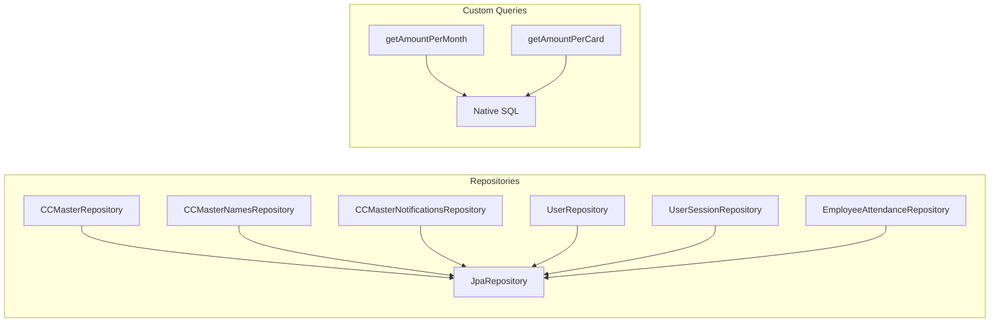
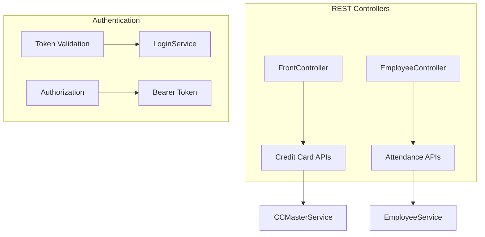

# Credit Card Backend Layer

## Table of Contents
1. [System Overview](#system-overview)
2. [Architecture](#architecture)
3. [Technology Stack](#technology-stack)
4. [Database Schema](#database-schema)
5. [API Endpoints](#api-endpoints)
6. [Scheduled Tasks](#scheduled-tasks)
7. [Security](#security)
8. [Data Flow Diagrams](#data-flow-diagrams)
9. [Component Architecture](#component-architecture)
10. [Deployment](#deployment)

---

## 1. System Overview

### Purpose
The Credit Card Backend Layer is a Spring Boot application designed to manage credit card billing, payments, and employee attendance tracking. It provides RESTful APIs for credit card management, automated notifications, data backup, and scheduled operations.

### Key Features
- Credit card bill management and tracking
- Automated email notifications for pending payments
- Monthly data backup with CSV generation
- Employee attendance tracking system
- User authentication and session management
- Scheduled tasks for automated operations

### System Context


---

## 2. Architecture

### Application Architecture
The application follows a layered architecture pattern with clear separation of concerns:



### Design Patterns Used
- **Repository Pattern**: Data access abstraction
- **Service Layer Pattern**: Business logic separation
- **Singleton Pattern**: Service beans
- **Factory Pattern**: Bean creation
- **Observer Pattern**: Event-driven notifications

---

## 3. Technology Stack

### Core Technologies
- **Framework**: Spring Boot 3.x
- **Language**: Java 17+
- **Build Tool**: Maven
- **Database**: MySQL
- **ORM**: Spring Data JPA

### Dependencies
```xml
<!-- Core Spring Boot -->
<dependency>
    <groupId>org.springframework.boot</groupId>
    <artifactId>spring-boot-starter-web</artifactId>
</dependency>

<!-- Database -->
<dependency>
    <groupId>org.springframework.boot</groupId>
    <artifactId>spring-boot-starter-data-jpa</artifactId>
</dependency>
<dependency>
    <groupId>mysql</groupId>
    <artifactId>mysql-connector-java</artifactId>
</dependency>

<!-- Email -->
<dependency>
    <groupId>org.springframework.boot</groupId>
    <artifactId>spring-boot-starter-mail</artifactId>
</dependency>

<!-- CSV Processing -->
<dependency>
    <groupId>com.opencsv</groupId>
    <artifactId>opencsv</artifactId>
</dependency>

<!-- Utilities -->
<dependency>
    <groupId>org.projectlombok</groupId>
    <artifactId>lombok</artifactId>
</dependency>
```

### Configuration
```properties
# Application Properties
server.port = 2990
spring.application.name = cc-backend-layer

# Database Configuration
spring.datasource.url = ${MYSQL_DB_URL}
spring.datasource.username = ${MYSQL_DB_USER}
spring.datasource.password = ${MYSQL_DB_PASS}
spring.jpa.hibernate.ddl-auto = none

# Email Configuration
spring.mail.host = smtp.gmail.com
spring.mail.port = 587
spring.mail.username = ${MAIL_USER}
spring.mail.password = ${MAIL_PASS}

# Connection Pool
spring.datasource.hikari.maximum-pool-size = 5
spring.datasource.hikari.minimum-idle = 2
```

---

## 4. Database Schema

### Entity Relationships


### Table Definitions

#### CC_MASTER_TEST
```sql
CREATE TABLE CC_MASTER_TEST (
    CODE VARCHAR(10) NOT NULL,
    STMTMONTHYEAR VARCHAR(10) NOT NULL,
    NAME VARCHAR(100),
    MINAMT INT,
    TOTALAMT INT,
    STMTDATE DATE,
    DUEDATE DATE,
    PAYDATE DATE,
    CURRENTSTATUS VARCHAR(50),
    REMARKS TEXT,
    CREATEDON TIMESTAMP,
    MODIFIEDON TIMESTAMP,
    USERNAME VARCHAR(50),
    PRIMARY KEY (CODE, STMTMONTHYEAR)
);
```

#### CC_MASTER_NAMES
```sql
CREATE TABLE CC_MASTER_NAMES (
    CODE VARCHAR(10) PRIMARY KEY,
    NAME VARCHAR(100) NOT NULL
);
```

#### CC_USERS
```sql
CREATE TABLE CC_USERS (
    USERNAME VARCHAR(50) PRIMARY KEY,
    PASSWORD VARCHAR(100) NOT NULL,
    ENABLED BOOLEAN DEFAULT TRUE,
    RETRIES INT DEFAULT 0,
    EMAIL VARCHAR(100)
);
```

#### CC_USERS_SESSION
```sql
CREATE TABLE CC_USERS_SESSION (
    SESSIONID INT AUTO_INCREMENT PRIMARY KEY,
    USERNAME VARCHAR(50),
    TOKEN VARCHAR(100),
    LOGINTIME TIMESTAMP,
    LOGOFFTIME TIMESTAMP,
    ACTIVE BOOLEAN DEFAULT TRUE,
    FOREIGN KEY (USERNAME) REFERENCES CC_USERS(USERNAME)
);
```

#### EMPLOYEE_ATTENDANCE
```sql
CREATE TABLE EMPLOYEE_ATTENDANCE (
    DATE DATE PRIMARY KEY,
    DAY VARCHAR(20),
    CM BOOLEAN DEFAULT FALSE,
    CE BOOLEAN DEFAULT FALSE,
    MM BOOLEAN DEFAULT FALSE,
    ME BOOLEAN DEFAULT FALSE,
    CW BOOLEAN DEFAULT FALSE
);
```

---

## 5. API Endpoints

### Credit Card Management

#### Authentication Required Endpoints
```http
GET /health
Response: "CC Backend Spring Boot is up and running"

GET /get
Authorization: Bearer <token>
Response: List<CCMaster>

POST /create
Authorization: Bearer <token>
Request Body: CCMaster object
Response: Created CCMaster object

GET /get/{code}/{monthYear}
Authorization: Bearer <token>
Response: CCMaster object

GET /get/{param}
Authorization: Bearer <token>
Response: List<CCMaster>

GET /monthlyTotal/{year}
Authorization: Bearer <token>
Response: List<AmountPerMonth>

GET /cardlyTotal/{year}
Authorization: Bearer <token>
Response: List<AmountPerMonth>

GET /cardNames
Authorization: Bearer <token>
Response: Map<String, String>
```

#### Authentication Not Required
```http
GET /notify
Response: void (triggers email notifications)

POST /login
Request Body: Users object
Response: UserSession object

POST /logout
Request Body: Users object
Response: boolean
```

### Employee Attendance

#### Web Endpoints
```http
GET /attendance
Response: HTML form for attendance

POST /attendance
Request Body: EmployeeListWrapper
Response: Success message
```

### API Response Formats

#### CCMaster Object
```json
{
    "key": {
        "code": "PNB01",
        "stmtMonthYear": "032024"
    },
    "name": "PNB Credit Card",
    "minAmt": 1000,
    "totalAmt": 15000,
    "stmtDate": "2024-03-01",
    "dueDate": "2024-03-21",
    "payDate": null,
    "currentStatus": "Bill Generated",
    "remarks": "Pending payment",
    "createdOn": "2024-03-01T10:30:00",
    "modifiedOn": null,
    "username": "user123"
}
```

#### UserSession Object
```json
{
    "sessionid": 123,
    "username": "user123",
    "token": "abc123def456",
    "logintime": "2024-03-01T10:30:00",
    "logofftime": null,
    "active": true,
    "error": null
}
```

---

## 6. Scheduled Tasks

### Task Scheduler Configuration
```java
@Component
public class ScheduledTasks {
    
    @Scheduled(cron = "0 30 23 * * *", zone = "Asia/Kolkata")
    public void execute() {
        ccMasterService.sendNotifications();
    }
    
    @Scheduled(cron = "0 10 0 * * *", zone = "Asia/Kolkata")
    public void insertDailyRecord() {
        employeeService.insertDailyRecord();
    }
    
    @Scheduled(cron = "0 35 23 * * 0", zone = "Asia/Kolkata")
    public void backup() {
        ccMasterService.dataBackup();
    }
    
    @Scheduled(cron = "0 0 23 1 * *", zone = "Asia/Kolkata")
    public void insertOnFirstEveryMonth() {
        // Insert PNB02 record
    }
}
```

### Scheduled Tasks Flow


---

## 7. Security

### Authentication Mechanism
```java
@Component
public class LoginService {
    
    public UserSession login(Users users) {
        // Validate credentials
        // Generate session token
        // Return session info
    }
    
    public boolean isValidToken(String token) {
        // Validate token
        // Check session active
        // Return username or null
    }
}
```

### Security Features
- **Token-based Authentication**: JWT-style tokens for session management
- **Password Security**: Plain text passwords (needs improvement)
- **Session Management**: Automatic session timeout and cleanup
- **Authorization**: Bearer token validation for protected endpoints
- **User Lockout**: Account lockout after 3 failed attempts

### Security Headers
- CORS enabled for cross-origin requests
- Authorization header required for protected endpoints
- Session-based authentication with token validation

---

## 8. Data Flow Diagrams

### Credit Card Data Flow


### Notification Flow


### Data Backup Flow


---

## 9. Component Architecture

### Service Layer Components


### Repository Layer


### Controller Layer


---

## 10. Deployment

### Environment Configuration
```properties
# Production Environment Variables
MYSQL_DB_URL=jdbc:mysql://localhost:3306/cc_database
MYSQL_DB_USER=cc_user
MYSQL_DB_PASS=secure_password
MAIL_USER=notifications@company.com
MAIL_PASS=app_specific_password
AUTH_HEADER_BP=Bearer backup_token
AUTH_USER_BP=backup_user
```

### Docker Configuration
```dockerfile
FROM openjdk:17-jdk-slim
WORKDIR /app
COPY target/cc-backend-layer.jar app.jar
EXPOSE 2990
ENTRYPOINT ["java", "-jar", "app.jar"]
```

### Build and Run
```bash
# Build the application
mvn clean package

# Run with environment variables
java -jar target/cc-backend-layer.jar \
  --MYSQL_DB_URL=jdbc:mysql://localhost:3306/cc_database \
  --MYSQL_DB_USER=cc_user \
  --MYSQL_DB_PASS=password \
  --MAIL_USER=notifications@company.com \
  --MAIL_PASS=app_password
```

### Monitoring and Logging
- **Logback Configuration**: Structured logging with Lombok
- **Health Checks**: `/health` endpoint for monitoring
- **Error Handling**: Comprehensive exception handling
- **Audit Trail**: Timestamps for all operations

### Scalability Considerations
- **Connection Pooling**: HikariCP with configurable pool size
- **Caching**: In-memory caching for card names
- **Async Processing**: Thread-based processing for notifications
- **Database Optimization**: Indexed queries and efficient joins

---

## Appendix A: Error Handling

### Common Error Scenarios
1. **Authentication Errors**: Invalid tokens, expired sessions
2. **Database Errors**: Connection failures, constraint violations
3. **Email Errors**: SMTP failures, invalid email addresses
4. **File System Errors**: Permission issues, disk space

### Error Response Format
```json
{
    "timestamp": "2024-03-01T10:30:00",
    "status": 401,
    "error": "Unauthorized",
    "message": "Invalid authentication token",
    "path": "/api/endpoint"
}
```

## Appendix B: Performance Considerations

### Database Optimization
- **Indexing**: Primary keys and frequently queried fields
- **Query Optimization**: Native SQL for complex aggregations
- **Connection Pooling**: HikariCP for efficient connection management
- **Lazy Loading**: JPA lazy loading for related entities

### Memory Management
- **Session Cleanup**: Automatic session timeout and cleanup
- **File Handling**: Temporary file cleanup after processing
- **Thread Management**: Controlled thread creation for background tasks

### Caching Strategy
- **Card Names**: In-memory caching for frequently accessed data
- **Session Validation**: Efficient token validation
- **Query Results**: JPA second-level cache (if enabled)

---

## Appendix C: Future Enhancements

### Potential Improvements
1. **Security**: Implement password hashing (BCrypt)
2. **Caching**: Add Redis for distributed caching
3. **Monitoring**: Integrate with Prometheus/Grafana
4. **API Documentation**: Add Swagger/OpenAPI documentation
5. **Testing**: Comprehensive unit and integration tests
6. **Microservices**: Break into smaller, focused services
7. **Message Queue**: Implement async processing with RabbitMQ/Kafka

### Feature Extensions
1. **Mobile App Integration**: Native mobile applications
2. **Real-time Updates**: WebSocket for live notifications
3. **Analytics Dashboard**: Visual reporting and analytics
4. **Multi-tenancy**: Support for multiple organizations
5. **Audit Logging**: Comprehensive audit trail system

---

**Document Version**: 1.0  
**Last Updated**: March 2024  
**Next Review**: June 2024
